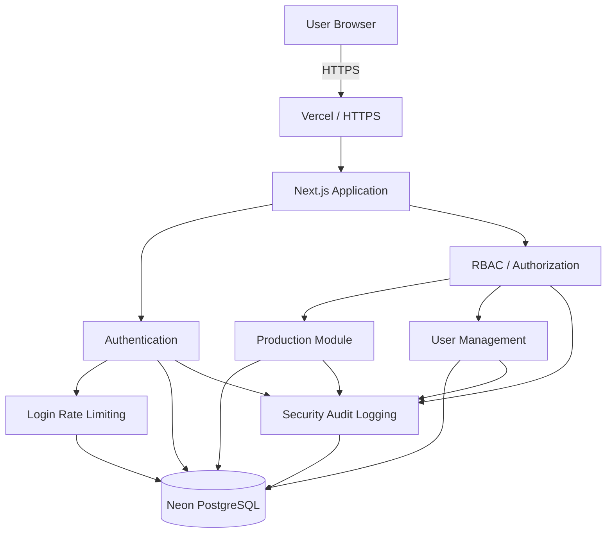
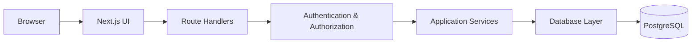
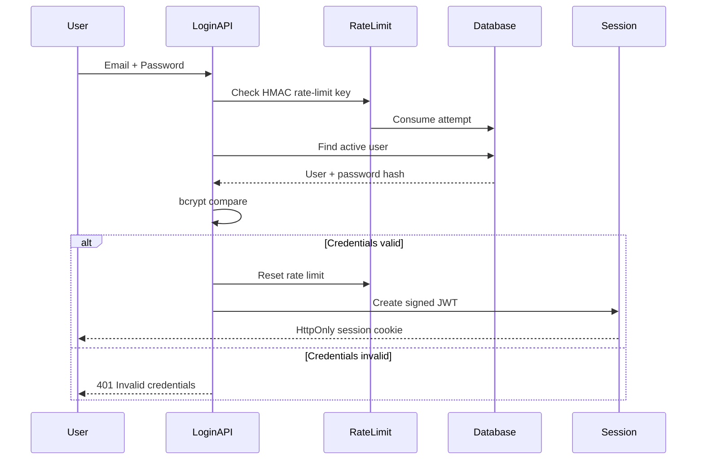
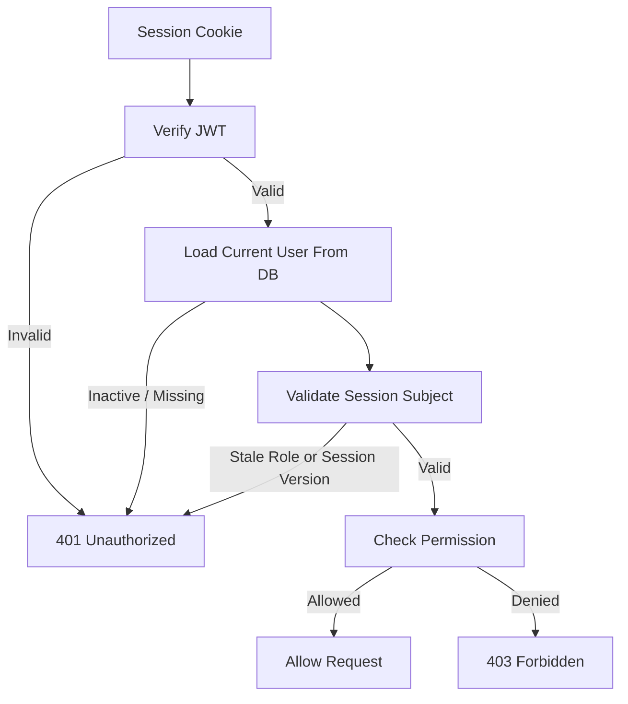
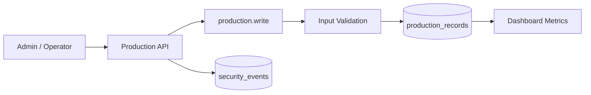
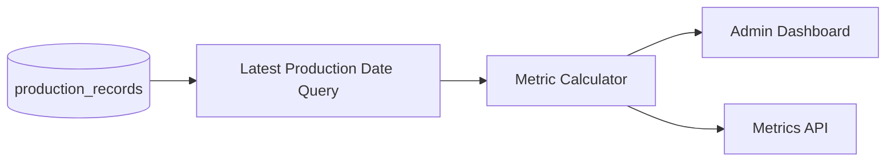
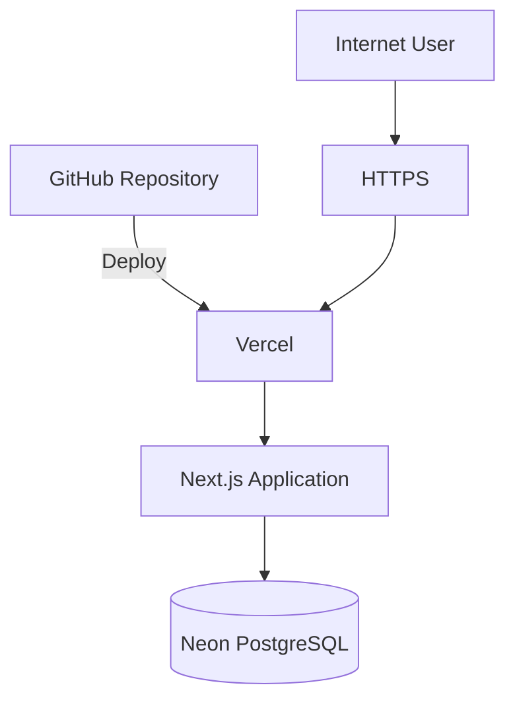

# SecureFactory Architecture

## Overview

SecureFactory is a Next.js industrial operations application designed to demonstrate secure application architecture.

The application combines:

* A public business website
* Authentication
* Protected administrative interfaces
* Role-Based Access Control
* Production management
* User management
* Security audit logging
* PostgreSQL persistence

## High-Level Architecture



## Application Layers



## Authentication Flow



## Session Validation

Every protected API request validates the current application state rather than trusting the JWT alone.



Session validation checks:

```text
user ID
email
role
session version
active account status
JWT issuer
JWT audience
JWT signature
JWT expiration
```

## Role-Based Access Control

The application defines the following permission model:

| Permission         | Admin | Operator | Viewer |
| ------------------ | ----: | -------: | -----: |
| `dashboard.read`   |   Yes |      Yes |    Yes |
| `production.read`  |   Yes |      Yes |    Yes |
| `production.write` |   Yes |      Yes |     No |
| `security.read`    |   Yes |      Yes |     No |
| `audit.read`       |   Yes |       No |     No |
| `users.read`       |   Yes |       No |     No |
| `users.manage`     |   Yes |       No |     No |

Authorization is enforced by protected route handlers.

UI visibility is a usability feature and is not treated as the security boundary.

## Production Data Flow



Viewer accounts use `production.read` and cannot perform state-changing operations.

## Database Model

Core PostgreSQL tables include:

```text
users
security_events
login_rate_limits
production_records
```

### users

Important fields include:

```text
id
email
password_hash
role
is_active
session_version
created_at
updated_at
```

### security_events

Stores application security and operational audit events.

Important fields include:

```text
event_type
email
ip_address
details
severity
created_at
```

### login_rate_limits

Stores persistent login attempt state using HMAC-derived identifiers.

### production_records

Stores production activity.

Important fields include:

```text
production_date
line_code
product_name
planned_units
produced_units
rejected_units
status
created_by
updated_by
created_at
updated_at
```

## Login Rate Limiting

Rate-limit identifiers are generated using:

```text
HMAC-SHA256(
  RATE_LIMIT_SECRET,
  normalized_ip + null_separator + normalized_email
)
```

The HMAC value is used as the PostgreSQL key instead of storing the raw IP/email combination as the identifier.

The login window is currently ten minutes with five allowed attempts.

## Audit Architecture

Security-relevant actions produce audit events.

Examples:

```text
LOGIN_SUCCESS
LOGIN_FAILURE
LOGIN_RATE_LIMITED
INVALID_SESSION
SESSION_REVOKED
AUTHORIZATION_DENIED
USER_ROLE_CHANGED
USER_DISABLED
USER_ENABLED
PRODUCTION_RECORD_CREATED
PRODUCTION_RECORD_UPDATED
```

Events are assigned severity levels and stored in PostgreSQL.

Emails and IP addresses are masked before appearing in audit records.

## Dashboard Metrics

Dashboard data is calculated from the latest available production date.



This ensures the UI and API use the same source of truth.

## Environment and Secrets

Application configuration is provided using server-side environment variables.

Required secrets:

```text
DATABASE_URL
SESSION_SECRET
RATE_LIMIT_SECRET
```

`SESSION_SECRET` and `RATE_LIMIT_SECRET` must be at least 32 characters.

Environment files containing real secrets are excluded from Git.

## Browser Security Controls

The deployment applies a defensive browser security policy including:

```text
Content-Security-Policy
Strict-Transport-Security
X-Content-Type-Options
X-Frame-Options
Referrer-Policy
Permissions-Policy
Cross-Origin-Opener-Policy
X-DNS-Prefetch-Control
X-Permitted-Cross-Domain-Policies
```

Administrative and API routes also use:

```text
X-Robots-Tag: noindex, nofollow, noarchive
```

## Deployment Architecture



## Trust Boundaries

The primary trust boundaries are:

```text
Browser ↔ Internet
Internet ↔ Vercel
Vercel Application ↔ PostgreSQL
Authenticated User ↔ Authorized Operation
```

The application treats all browser input as untrusted.

Authentication does not imply authorization.

Database writes are performed only after server-side permission and validation checks.

## Design Principles

SecureFactory follows several security-focused design principles:

```text
Server-side authorization
Least privilege
Defense in depth
Secure defaults
Fail closed
Input validation
Parameterized queries
Session revocation
Auditability
Secret isolation
```

## Scope

This architecture represents a portfolio demonstration system.

It is designed to demonstrate secure software-engineering patterns and is not presented as a production industrial control system or safety-critical manufacturing platform.
